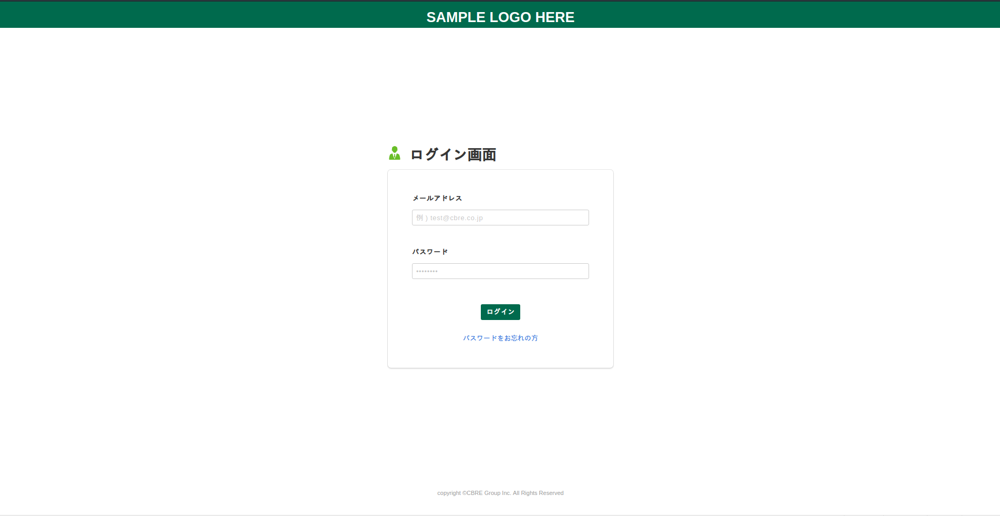
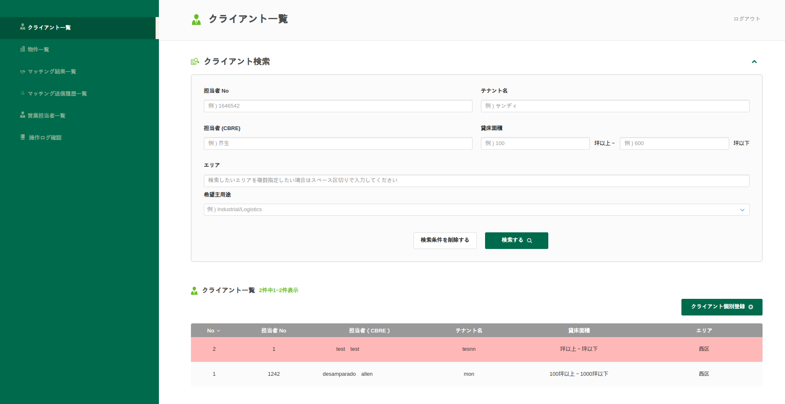

# Read Me

You may implement the exam any way you want or you may choose from the following. 

<ul type="a">
<li>create using laravel only (from default-laravel installation)</li>
<li>create an API driven using laravel-vue (from default-laravel installation)</li>
<li>create an API driven using laravel - vue each framework in a separate directory </li>
</ul>

These following installation steps along with the pre-configured vendor packages, are already done for you:

-   \$composer install
-   \$npm install

The following packages are already installed: 

-   composer packages:
    -   laravel/framework
    -   laravel/tinkers
    -   prettus/l5-repository
    -   prettus/laravel-validation
    -   barryvdh/laravel-debugbar
    -   barryvdh/laravel-cors
    -   spatie/laravel-activitylog
-   npm packages:
    -   laravel-mix
    -   vue
    -   vuex
    -   axios
    -   vue-router
    -   bootstraps
    -   lodash
    -   fontawesome

The following environment configurations are required for the exam, some of these may already be provided for you but in the case it is not please create/install/correct it as required.

-   Workspace directory: ~/Desktop/Laravel-Exam/\${EXAMINEE_NAME}
-   PHP Version: >=7.2.\*
-   MYSQL:
    -   Host: 127.0.0.1
    -   Version 5.6.\*
    -   Username: "examinee"
    -   Password: "password"
    -   Database: LARAVEL\_{\$EXAMINEE_NAME}\_DB

<!-- should you have request for other dependencies/packages, please ask before the exam. -->

 

# PRACTICAL EXAMINATION

**MAXIMUM OF 3 HOURS**

A client requires a Mini-CRM UI which includes an admin panel to manage companies and the company-employees and a company dashboard for their company-users to view their employees into and for employees to view scrum task in their companies.

#### Main Objectives:

1. Basic Laravel Auth: ability to log in as administrator
2. Use database seeds/faker to create sample users with email **admin@admin.com** and hashed password **“password”**
3. CRUD functionality (Create / Read / Update / Delete) for two menu items: **Companies** and **Employees**.
4. Companies DB table must consists of these fields: Name (required), Address(required), website,
5. Employees DB table must consists of these fields: First name (required), last name (required), Company (foreign key to Companies), email, phone
6. Use database migrations to create the database schemas
7. Use of Basic Laravel Controllers and Model
8. Use Laravel’s validation
    - Email must be a valid email
    - Password must be atleast 6 characters long.
    - Database required fields must be required
9. Pagination for showing Companies/Employees list, with 10 entries per page
10. Use Laravel's Eloquent ORM for queries and searching.

### Extra:

1. Email notification: send email whenever new company is entered
2. Basic testing with phpunit
3. Comment/Documentation when coding
4. Authentication of Companies and Employees
5. Dashboard of Companies and Employees
6. Logging of any user's activity

 
 

Details

With the main objective of the exam, the examinee should show the skills and understanding of the following:

-   MVC (Model-View-Controller) design pattern
-   Authentication
-   CRUD and Resource Controllers
-   Eloquent and Relationships
-   Database migrations and seeds
-   Form Validation and Requests
-   File management
-   Basic CSS
-   Pagination
-   Searching

On extra modules, the examinee would show the skills and understanding of the following:

-   Understanding of Laravel Notifiable and Email Service
-   Understanding the importance of automated code-testing
-   Laravel Coding Convention and practices.
-   Understanding of Laravel Authentication Service and concepts

 
 

## SAMPLE LOGIN

## SAMPLE Admin Panel

NOTE: It is not necessary you follow the UI-Design
